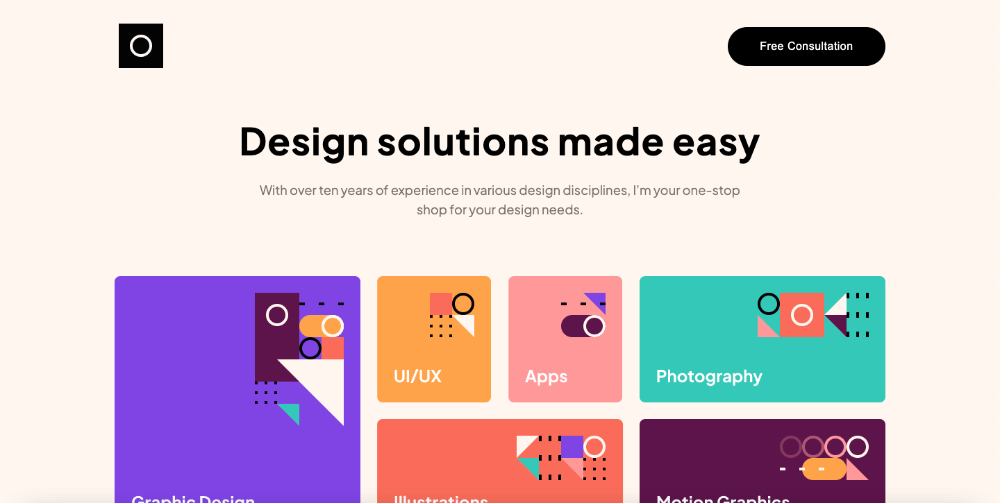

This is a [Next.js](https://nextjs.org/) project bootstrapped with [`create-next-app`](https://github.com/vercel/next.js/tree/canary/packages/create-next-app).

## Getting Started

First, run the development server:

```bash
npm run dev
# or
yarn dev
```
# Frontend Mentor - Single-page design portfolio solution

This is a solution to the [Single-page design portfolio challenge on Frontend Mentor](https://www.frontendmentor.io/challenges/singlepage-design-portfolio-2MMhyhfKVo). Frontend Mentor challenges help you improve your coding skills by building realistic projects. 

## Table of contents

- [Overview](#overview)
  - [The challenge](#the-challenge)
  - [Screenshot](#screenshot)
  - [Links](#links)
- [My process](#my-process)
  - [Built with](#built-with)
  - [Continued development](#continued-development)
  - [Useful resources](#useful-resources)
- [Author](#author)

## Overview

### The challenge

Users should be able to:

- View the optimal layout for the site depending on their device's screen size
- See hover states for all interactive elements on the page
- Navigate the slider using either their mouse/trackpad or keyboard

### Screenshot



### Links

- Live Site URL: [Vercel deployment](https://single-page-design-portfolio.vercel.app/)

## My process

1. Download starter files
2. Download design files
3. Export design files into svg format and open them using a web browser
4. Develop the web page on desktop view from top to bottom using the exported svg's as guidance
5. Adjust the design on tablet and mobile view
6. When the design layout is finished, start working on the functionality
7. Review, deploy and publish the final result

### Built with

- Semantic HTML5 markup
- CSS custom properties
- Flexbox
- CSS Grid
- Desktop-first workflow
- [React](https://reactjs.org/) - JS library
- [Next.js](https://nextjs.org/) - React framework
- [Framer-motion](https://www.framer.com/motion/) - For animation

### Continued development

During this project I have mainly focused on the design and functionality, leaving out essential accessibility aspects. Moving forward I plan on working towards developing more accessible applications.
